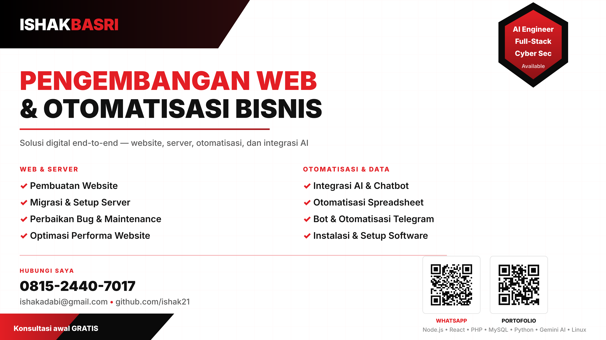
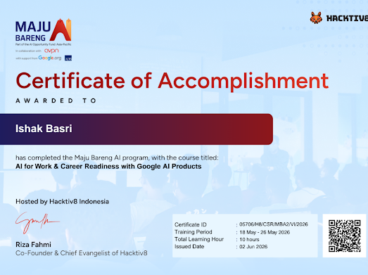
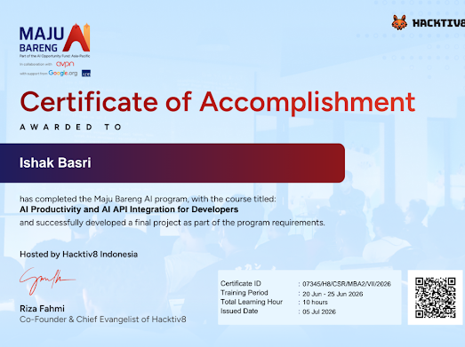
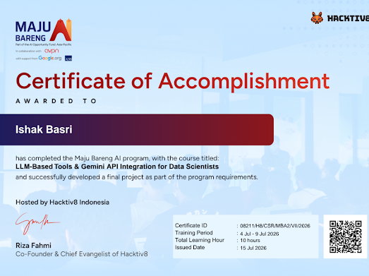

# Halo, saya Ishak Basri 👋

### Full-Stack Developer · AI Engineer · Data Scientist · Researcher · Cyber Security Enthusiast

---

### 🧭 Tentang Saya

Pengembang full-stack dengan pengalaman membangun aplikasi web, sistem e-commerce, dan otomatisasi bisnis dari nol hingga produksi. Merambah ke rekayasa AI dan data science, dengan ketertarikan mendalam pada riset teknis dan keamanan siber.

- 🔭 Sedang mengerjakan sistem web berbasis Node.js/React dengan integrasi AI
- 🤖 Membangun chatbot dan otomatisasi berbasis Gemini API
- 📊 Menjelajahi data science dan analisis data untuk pengambilan keputusan bisnis
- 🛡️ Mendalami cyber security — dari fundamental hingga tooling praktis
- 🏢 Membangun sistem operasional bisnis (manajemen hotel, e-commerce, sistem pesanan) dengan otomatisasi Excel VBA dan integrasi cloud

---

### 💼 Layanan

Menerima proyek freelance & kontrak. Konsultasi awal gratis — silakan hubungi lewat [WhatsApp](https://wa.me/6281524407017) atau [email](mailto:ishakadabi@gmail.com).

<table>
<tr>
<td width="50%" valign="top">

**🌐 Web & Server**

- Pembuatan website & aplikasi web
- Migrasi & setup server (VPS, Nginx, PM2)
- Perbaikan bug & maintenance berkala
- Optimasi performa dan keamanan website

</td>
<td width="50%" valign="top">

**⚡ Otomatisasi & Data**

- Integrasi AI & pengembangan chatbot
- Otomatisasi spreadsheet (Excel VBA, Google Apps Script)
- Sinkronisasi Google Sheets ↔ Excel
- Bot & otomatisasi Telegram
- Instalasi & konfigurasi software perkantoran

</td>
</tr>
</table>

---

### 🛠️ Tech Stack

**Bahasa & Framework**

**Database & Cloud**

**AI & Data**

**Tools & Lainnya**

---

### 📌 Proyek Unggulan

| Proyek | Deskripsi |
|---|---|
| **GoMolion** | Platform e-commerce & sistem member dengan backend Node.js/Express dan frontend React, terintegrasi payment gateway |
| **Gemini AI Chatbot** | Chatbot berbasis Express.js dan Gemini 2.5 Flash API |
| **Sistem Hotel Liman** | Sistem manajemen hotel berbasis Excel VBA dengan sinkronisasi real-time ke Google Sheets |
| **Sistem Pesanan Penjualan** | Sistem pencatatan dan pengelolaan pesanan penjualan |

---

### 🎓 Sertifikasi

Program **Maju Bareng AI** oleh Hacktiv8 Indonesia — kolaborasi dengan Google.org dan AI Opportunity Fund Asia-Pacific.

<table>
<tr>
<td width="33%">

**AI for Work & Career Readiness with Google AI Products**
📅 18–26 Mei 2026 · 10 jam
🆔 05706/H8/CSR/MBA2/VI/2026

</td>
<td width="33%">

**AI Productivity and AI API Integration for Developers**
📅 20–25 Jun 2026 · 10 jam
🆔 07345/H8/CSR/MBA2/VII/2026

</td>
<td width="33%">

**LLM-Based Tools & Gemini API Integration for Data Scientists**
📅 4–9 Jul 2026 · 10 jam
🆔 08211/H8/CSR/MBA2/VII/2026

</td>
</tr>
</table>

---

### 📊 GitHub Stats

---

### 📫 Hubungi Saya

